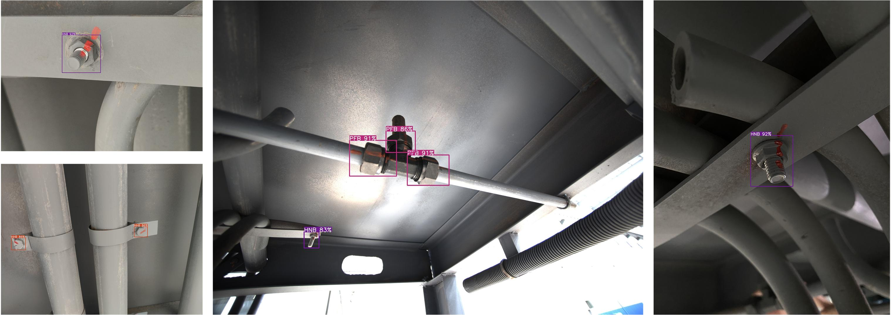

# ERBW-Bolt: A high-accuracy model for train underbody bolts detection in complex background

    

## Train underbody bolts dataset:
+ download the dataset here  
[download link](https://drive.google.com/file/d/12MH6mzOmBdJsHHr5u5QUMJmN7D39OPqO/view?usp=drive_link)

## Model
./models/  
+ pre-trained model: [ERBW-Bolt.pt](https://drive.google.com/file/d/1xpMrT7MEWYQPP3FFaPnqNdhIujE3I3hk/view?usp=drive_link)
+ deployment model: [ERBW-Bolt.onnx](https://drive.google.com/file/d/1sK-Sypf4MBTagxrZL-77YzZQB_hMroye/view?usp=drive_link)

